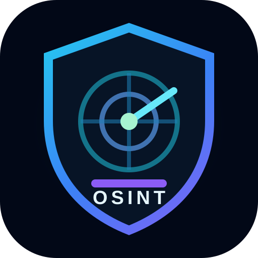

<div align="center">



# 🛰️ OSINT Master Toolkit v2

### Dashboard OSINT Việt hóa · mở rộng · loại trùng ở tầng dữ liệu

**OSINT ALERT! 🚀 Mệt mỏi vì phải tìm công cụ ở khắp mọi nơi?**

[](./index.html)
[](./gee/)
[](#-43-danh-mục-osint)
[](#-loại-trùng-dữ-liệu)
[](#-popup-mục-đích--cách-dùng)
[](./LICENSE)

**Search • AI • Geolocation • Breaches • Social Media • Blockchain • News • Academic • OCR • Patents • Podcasts • Network Analysis • OPSEC**
https://base27-cvnss.github.io/OSINT/
### 🧭 Do **Long Ngo** sưu tầm và cập nhật

</div>

---

## 🚨 OSINT ALERT!

**OSINT Master Toolkit v2** là một dashboard directory giúp tổ chức hàng trăm công cụ điều tra nguồn mở vào một giao diện duy nhất, ưu tiên **tiếng Việt, tìm kiếm nhanh, phân loại rõ, popup giải thích công dụng và khả năng chạy trực tiếp trên GitHub Pages**.

Phiên bản hiện tại không còn chỉ ẩn URL trùng ở giao diện. Dữ liệu được **chuẩn hóa và loại trùng trước khi render**, giúp bộ đếm, danh mục và kết quả tìm kiếm phản ánh tập công cụ duy nhất thực tế.

> Đây là **directory liên kết và tài liệu tham khảo**, không phải công cụ xâm nhập, crawler hay bộ thu thập dữ liệu tự động.

## 🛰️ Chuyên trang GEE OSINT Việt Nam

Repository có thêm **[GEE OSINT Việt Nam](./gee/)** — trạm điều phối **242 tài nguyên Google Earth Engine** được Việt hóa và tổ chức từ danh mục [opengeos/Awesome-GEE](https://github.com/opengeos/Awesome-GEE).

- 🔎 Tìm kiếm không dấu theo tên, domain, công nghệ và chủ đề.
- 🧭 Lọc JavaScript, Python, R, QGIS, ứng dụng, dữ liệu và nghiên cứu.
- ⭐ Lưu tài nguyên yêu thích trên trình duyệt, không cần tài khoản.
- 🌓 Giao diện sáng/tối, responsive và hỗ trợ bàn phím.
- 📚 Ghi nguồn Qiusheng Wu, CC0 1.0 và giữ tên gốc để đối chiếu.

**Truy cập:** <https://base27-cvnss.github.io/OSINT/gee/>

## ✨ Cập nhật mới

- 🧭 Mở rộng từ **34 lên 43 danh mục Việt hóa**.
- ➕ Thêm **43 công cụ tuyển chọn** cho các khoảng trống còn thiếu.
- ♻️ Thêm `data/dedupe.js` để loại trùng ở **tầng dữ liệu**.
- 🔗 Chuẩn hóa khác biệt `http/https`, `www`, dấu `/` cuối và một số tracking parameters trước khi so trùng.
- 🪟 Popup có **Mục đích + Cách dùng + Nguồn/kiểm tra**.
- 🏷️ Nhãn mới: **Handbook 2016**, **Bổ sung 2026**, **Rà soát 2026**, **GitBook**.
- 📚 Bổ sung học thuật, grey literature, patent, sách/thư viện, podcast/radio, monitoring, OCR và network analysis.
- 🔎 Giữ tìm kiếm, lọc Free/Paid/CLI và ★ yêu thích bằng `localStorage`.
- 📱 Responsive, không framework, không backend, không analytics.

## ♻️ Loại trùng dữ liệu

`data/dedupe.js` chạy **sau khi nạp toàn bộ data pack và trước khi dashboard render**.

Canonical URL được dùng để nhận diện trùng lặp:

```text
https://www.example.com/
http://example.com
https://example.com/?utm_source=x
```

Các biến thể trên có thể được quy về cùng một khóa. Khi trùng:

1. chỉ giữ một bản ghi;
2. hợp nhất tag;
3. giữ metadata popup chi tiết nếu có;
4. dashboard hiển thị số bản ghi trùng đã loại ngay dưới phần giới thiệu.

Cách này xử lý cả các trùng lặp đã tồn tại từ nhiều đợt nhập dữ liệu trước đó như cùng một website xuất hiện ở hai danh mục hoặc hai nguồn khác nhau.

## 🧭 43 danh mục OSINT

Bên cạnh nhóm nền như Phone, Email, Username, DNS, Breaches, Social Media, Telegram, AI, Geolocation, Public Records, Blockchain, Threat Intel và Image/Video, đợt cập nhật này thêm 9 nhóm:

| Danh mục mới | Dùng vào mục đích gì |
|---|---|
| 📰 Tin tức & Truyền thông | Theo dõi và phân tích dòng tin toàn cầu, coverage và nguồn báo chí |
| 🎓 Học thuật & Grey Literature | Công bố, DOI, tác giả, citation, dataset và open science |
| 🔔 Giám sát web & Cảnh báo | RSS, watchlist và phát hiện thay đổi nội dung |
| 📄 OCR & Tài liệu | OCR, PDF, bảng, document parsing và làm sạch dữ liệu |
| 🕸️ Mạng lưới & Quan hệ | Graph, nodes/edges, social-network analysis và link analysis |
| 🎙️ Phát thanh & Podcast | Radio, podcast, episode và nguồn âm thanh công khai |
| 💡 Sáng chế & Sở hữu trí tuệ | Patent, trademark, applicant, inventor, family và citations |
| 📚 Sách & Thư viện | Books, catalog, edition, bản đồ và tài liệu số hóa |
| 👤 Chuyên gia & Nghề nghiệp | Nhà nghiên cứu, nhà báo, chuyên gia và dấu vết nghề nghiệp |

## 🧩 Gói công cụ mới

Một số công cụ nổi bật được bổ sung:

- **GDELT Project, Media Cloud** — news intelligence và media analysis.
- **OpenAlex, CORE, BASE, Semantic Scholar, Crossref, OpenAIRE, Zenodo, DOAJ** — research & grey literature.
- **Google Alerts, Talkwalker Alerts, Feedly, Inoreader, Distill, changedetection.io** — monitoring.
- **Tesseract OCR, OCRmyPDF, OCR.Space, Tabula, OpenRefine, Docling** — tài liệu và OCR.
- **Gephi, NodeXL, Graph Commons, Kumu** — phân tích mạng lưới.
- **Listen Notes, Radio Garden, Podchaser, Podcast Index** — radio & podcast.
- **Google Patents, Espacenet, WIPO PATENTSCOPE, Lens, WIPO Global Brand Database** — sở hữu trí tuệ.
- **WorldCat, Open Library, Google Books, HathiTrust, Library of Congress Catalog** — sách và thư viện.
- **ORCID, Muck Rack, ResearchGate** — chuyên gia và nghề nghiệp.

## 🪟 Popup “Mục đích + Cách dùng”

Mỗi thẻ công cụ khi rê chuột hoặc focus có thể hiển thị:

```text
🎯 Mục đích
Công cụ dùng cho bước OSINT nào?

🧭 Cách dùng
Loại dữ liệu nên nhập và cách xác minh kết quả.

Nhóm
Danh mục OSINT tương ứng.

Nguồn/kiểm tra
GitBook / Handbook 2016 / Bổ sung 2026 / Rà soát 2026.
```

Các công cụ mới trong `tools-11.js` có metadata riêng thay vì chỉ dùng mô tả chung theo danh mục.

## 🕰️ Tài liệu Handbook 2016 được dùng như thế nào?

Đợt cập nhật này tham khảo **Open Source Intelligence Tools and Resources Handbook — November 2016** do người dùng cung cấp.

Tài liệu có taxonomy rất rộng: search, social media, people, company, academic, geospatial, news, fact-checking, monitoring, OCR/PDF, automation, social network analysis, privacy/encryption và nhiều nhóm khác.

Do tài liệu đã cũ, repository **không nhập nguyên danh sách URL năm 2016**. Quy trình là:

1. dùng Handbook để phát hiện nhóm còn thiếu;
2. đối chiếu dữ liệu hiện có để tránh nhập lại;
3. ưu tiên website/repository chính thức còn hoạt động;
4. bổ sung công cụ hiện đại thay cho những dịch vụ đã lỗi thời;
5. ghi nguồn/đợt rà soát trong popup.

Xem thêm: [`SOURCES.md`](./SOURCES.md).

## 🏗️ Cấu trúc repository

```text
OSINT/
├── README.md
├── SOURCES.md
├── LICENSE
├── index.html
├── assets/
│   └── osint-shield.svg
└── data/
    ├── tools.js
    ├── tools-1.js ... tools-5.js    # dữ liệu nền
    ├── tools-6.js ... tools-10.js   # mở rộng GitBook
    ├── tools-11.js                  # 43 công cụ tuyển chọn mới
    ├── dedupe.js                    # canonical URL + loại trùng dữ liệu
    └── enhance.js                   # popup Việt hóa + nguồn + audit
```

## 🔎 Cách sử dụng

1. Mở `index.html` hoặc GitHub Pages.
2. Tìm bằng tên công cụ, domain hoặc danh mục.
3. Chọn nhóm ở thanh bên.
4. Rê chuột/focus để đọc popup.
5. Nhấn **Mở công cụ ↗** để tới website chính thức.
6. Nhấn ★ để lưu công cụ thường dùng trên trình duyệt hiện tại.

## ⚖️ Sử dụng OSINT có trách nhiệm

OSINT không đồng nghĩa với quyền truy cập không giới hạn.

- Chỉ sử dụng dữ liệu công khai hoặc dữ liệu bạn có quyền truy cập.
- Tuân thủ pháp luật, điều khoản dịch vụ và quyền riêng tư.
- Xác minh chéo trước khi đưa ra kết luận.
- Không sử dụng danh mục cho quấy rối, doxxing, xâm nhập trái phép hoặc thu thập dữ liệu nhạy cảm bất hợp pháp.

## 📚 Nguồn & ghi nhận

**Phiên bản Việt hóa / tuyển chọn: Do Long Ngo sưu tầm và cập nhật.**

Nguồn tham khảo và chính sách tuyển chọn được ghi tại [`SOURCES.md`](./SOURCES.md). Tên sản phẩm, logo, nhãn hiệu, nội dung website và giấy phép của từng công cụ thuộc về chủ sở hữu tương ứng.

## 📄 License

Mã dashboard của repository này được phát hành theo **MIT License**.

MIT của dashboard **không thay thế hoặc mở rộng giấy phép của các dự án / website bên thứ ba** được liệt kê trong danh mục.

---

<div align="center">

**OSINT Master Toolkit v2 · Base27-CVNSS · 2026**

🧭 **Do Long Ngo sưu tầm và cập nhật**

**Vietnamese Edition • Open Source Community • Responsible OSINT**

</div>
