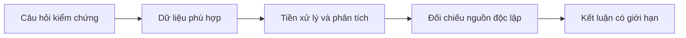
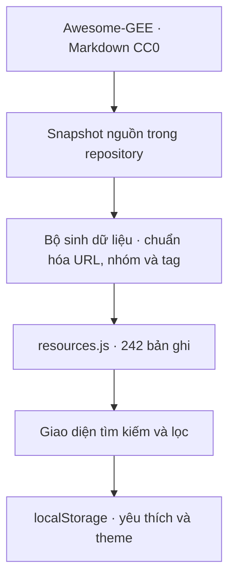

<div align="center">


# 🛰️ GEE OSINT Việt Nam

### Trạm điều phối tài nguyên Google Earth Engine dành cho cộng đồng Việt Nam

[](https://base27-cvnss.github.io/OSINT/gee/)
[](./index.html)
[](#-phạm-vi-việt-hóa)
[](https://github.com/opengeos/Awesome-GEE)
[](https://creativecommons.org/publicdomain/zero/1.0/)
[](../LICENSE)

**JavaScript · Python · R · QGIS · Landsat · Sentinel · Dữ liệu · Khóa học · Ứng dụng · Nghiên cứu**

> Bản tiếng Việt được biên tập bởi **Long Ngo · Base27-CVNSS**, dựa trên danh mục **Awesome-GEE** do **Qiusheng Wu** khởi tạo và cộng đồng đóng góp.

</div>

---

## 🌍 GEE OSINT Việt Nam là gì?

**GEE OSINT Việt Nam** là một cổng tra cứu tĩnh giúp tổ chức các nguồn tài nguyên về **Google Earth Engine (GEE)** thành một không gian tìm kiếm tiếng Việt thống nhất.

Trang này giải quyết ba vấn đề thực tế:

1. Tài nguyên Earth Engine nằm rải rác giữa tài liệu Google, GitHub, khóa học, video, ứng dụng, bộ dữ liệu và bài báo.
2. Người mới thường chọn công cụ trước khi xác định đúng câu hỏi, dữ liệu và giới hạn phân tích.
3. Một danh sách Markdown dài rất tốt cho lưu trữ, nhưng khó tìm nhanh theo công nghệ, loại nguồn hoặc mục tiêu điều tra.

Dashboard biến danh mục gốc thành một **trạm điều phối GEOINT/OSINT mở**: tìm kiếm, lọc, đọc mô tả tiếng Việt, xem tên gốc, lưu mục yêu thích và mở trực tiếp nguồn chính thức.

> Đây là **directory tài nguyên và tài liệu định hướng**. Website không chạy tác vụ Earth Engine, không yêu cầu khóa API, không thu thập thông tin đăng nhập và không thay thế tài liệu chính thức của Google.

## 🧭 Vì sao Google Earth Engine liên quan đến OSINT?

OSINT là quá trình thu thập và phân tích thông tin từ các nguồn được phép truy cập công khai. Trong miền địa không gian, Earth Engine cung cấp hạ tầng để truy vấn và xử lý nhiều lớp quan sát Trái Đất như Landsat, Sentinel, MODIS, lớp phủ đất, nước mặt, khí hậu và dữ liệu cộng đồng.

Giá trị điều tra không nằm ở việc “có ảnh vệ tinh”, mà nằm ở chuỗi lập luận:



Ví dụ ứng dụng hợp pháp:

- 🌳 Theo dõi mất rừng, cháy rừng và phục hồi thảm thực vật.
- 🌊 Đánh giá biến động nước mặt, ngập lụt, đường bờ và đất ngập nước.
- 🌾 Quan sát mùa vụ, hạn hán và biến động sử dụng đất nông nghiệp.
- 🏙️ Phân tích mở rộng đô thị và thay đổi lớp phủ đất theo thời gian.
- 🆘 Hỗ trợ đánh giá thiên tai bằng dữ liệu đa thời gian.
- 📚 Tái lập phương pháp từ bài báo khoa học và notebook công khai.

## ✨ Tính năng chính

| Tính năng | Mô tả |
|---|---|
| 🔎 Tìm kiếm không dấu | Tìm theo tên Việt/Anh, domain, nhóm, tag, công nghệ hoặc mô tả |
| 🧭 Bộ lọc 17 nhóm | Nguồn chính thức, JavaScript, Python, R, QGIS, ứng dụng, dữ liệu, nghiên cứu… |
| ⚡ Bộ lọc nhanh | Chính thức, JavaScript, Python, dữ liệu, học thuật và mục đã lưu |
| ⭐ Yêu thích cục bộ | Lưu trong `localStorage`; không gửi dữ liệu ra máy chủ |
| 🌓 Sáng/tối | Ghi nhớ giao diện trên trình duyệt hiện tại |
| 🪟 Chi tiết tài nguyên | Hiển thị nhóm, mô tả tiếng Việt, tên gốc, tag và cảnh báo liên kết cũ |
| 📱 Responsive | Tối ưu desktop, tablet và điện thoại; điều hướng danh mục dạng drawer trên mobile |
| ♿ Khả năng tiếp cận | Semantic HTML, nhãn ARIA, điều hướng bàn phím, focus rõ và hỗ trợ giảm chuyển động |
| 🔗 URL có trạng thái | Từ khóa, nhóm, bộ lọc và sắp xếp được phản ánh trên URL để chia sẻ |
| 🛡️ Không phụ thuộc backend | HTML/CSS/JavaScript thuần, chạy trực tiếp trên GitHub Pages |

## 📊 Phạm vi dữ liệu

Snapshot ngày **04/08/2026** nhập **242 URL duy nhất** từ `opengeos/Awesome-GEE` và tổ chức thành các nhóm tiếng Việt.

| Nhóm | Nội dung chính |
|---|---|
| 🟢 Nguồn chính thức | Trang chủ, Code Editor, API, Data Catalog, cộng đồng và issue tracker |
| 🟨 Bắt đầu & trợ giúp | Đăng ký, mô hình client–server, best practices, diễn đàn và kênh hỗ trợ |
| 🟦 JavaScript API | Thư viện, repository, cookbook, tutorial và công cụ cho Code Editor |
| 🐍 Python API | `earthengine-api`, geemap, notebook, CLI, xarray, TensorFlow và công cụ tải dữ liệu |
| 📐 R & QGIS | `rgee`, ví dụ R, plugin QGIS và tutorial tích hợp |
| 👥 Cộng đồng | Tổ chức, nhà phát triển, chuyên gia và các kênh theo dõi |
| 🧩 Ứng dụng | Earth Engine Apps, thư viện ứng dụng và sản phẩm phân tích công khai |
| 🎓 Học tập | Khóa học miễn phí, slide, webinar, video và sách |
| 🗺️ Website chuyên đề | Rừng, nước mặt, khí hậu, đường bờ và công cụ hỗ trợ quyết định |
| 🛰️ Bộ dữ liệu | Landsat, Sentinel, NAIP, lớp phủ đất và dữ liệu cộng đồng |
| 🔬 Nghiên cứu | Tổng quan, thủy văn, đô thị, thảm thực vật, nông nghiệp, thiên tai và ven biển |

### Trạng thái “Cần rà soát”

Một số URL trong danh mục gốc sử dụng `http`, `appspot.com`, `twitter.com`, liên kết rút gọn hoặc nền tảng đã đổi cấu trúc. Dashboard **không tự tuyên bố các URL này đã chết**; nó chỉ gắn nhãn để người dùng kiểm tra kỹ trước khi dùng.

## 🇻🇳 Phạm vi Việt hóa

- Toàn bộ giao diện, điều hướng, bộ lọc, mô tả nhóm, cảnh báo và tài liệu sử dụng bằng tiếng Việt.
- Các nhãn chung như “Official homepage”, “Data Catalog”, “Report a bug”, tên tutorial phổ biến và tên dữ liệu được dịch sang tiếng Việt.
- Tên dự án, package, tổ chức, tác giả, tiêu đề bài báo và thuật ngữ API được giữ nguyên khi dịch có thể làm sai định danh hoặc gây khó tra cứu.
- Khi một tên đã dịch, dashboard vẫn hiển thị **tên gốc** để đối chiếu.
- Mỗi thẻ có mô tả tiếng Việt theo vai trò của nhóm tài nguyên; nội dung chi tiết cuối cùng vẫn nằm tại nguồn đích.

## 🧠 Bản chất và nguyên lý hoạt động

Hệ thống có bốn lớp đơn giản:



### 1. Lớp nguồn

`source/awesome-gee-en.md` lưu snapshot của danh mục gốc. Việc giữ snapshot giúp truy xuất nguồn, so sánh thay đổi và tái tạo dữ liệu mà không phụ thuộc vào request runtime đến GitHub.

### 2. Lớp chuẩn hóa

`scripts/build-resources.mjs` đọc Markdown, xác định tiêu đề cấp 2–3, trích URL, loại URL trùng, suy luận tag và sinh `data/resources.js`.

Các thuộc tính chính của một bản ghi:

```js
{
  id: "gee-001",
  name: "Trang chủ chính thức",
  originalName: "Official homepage",
  url: "https://earthengine.google.com/",
  section: "Nguồn chính thức",
  group: "Nguồn chính thức",
  description: "Cổng chính thức để truy cập...",
  tags: ["Nguồn chính thức", "Chính thức"],
  official: true,
  legacy: false
}
```

### 3. Lớp trình bày

`app.js` nạp dữ liệu đã chuẩn hóa, tìm kiếm không dấu, áp dụng bộ lọc giao nhau, sắp xếp kết quả và dựng card. Không có framework hoặc bước build bắt buộc.

### 4. Lớp trạng thái cục bộ

Danh sách yêu thích và chế độ sáng/tối chỉ được lưu trên thiết bị bằng `localStorage`. Website không có tài khoản người dùng, cookie theo dõi hay analytics.

## 🏗️ Kiến trúc thư mục

```text
gee/
├── index.html                    # Giao diện semantic và nội dung giới thiệu
├── styles.css                    # Design system, responsive, dark/light
├── app.js                        # Tìm kiếm, lọc, dialog, yêu thích, URL state
├── README.md                     # Tài liệu tiếng Việt
├── SOURCES.md                    # Nguồn, giấy phép và chính sách tuyển chọn
├── assets/
│   └── gee-mark.svg              # Biểu tượng GEE OSINT Việt Nam
├── data/
│   └── resources.js              # Dữ liệu đã sinh; không sửa trực tiếp
├── scripts/
│   └── build-resources.mjs       # Bộ nhập và chuẩn hóa Markdown
└── source/
    └── awesome-gee-en.md         # Snapshot danh mục gốc CC0
```

## 🚀 Cách sử dụng

### Dùng trực tuyến

Mở **[GEE OSINT Việt Nam](https://base27-cvnss.github.io/OSINT/gee/)**, sau đó:

1. Nhập tên công cụ, dữ liệu hoặc chủ đề vào ô tìm kiếm.
2. Chọn danh mục ở cột trái hoặc dùng bộ lọc nhanh.
3. Nhấn **Chi tiết** để xem tên gốc, nhóm, tag và lưu ý.
4. Nhấn **Mở** để đi tới website hoặc repository chính thức.
5. Nhấn biểu tượng ⭐ để lưu tài nguyên dùng thường xuyên.

### Phím tắt

| Phím | Tác dụng |
|---|---|
| `/` | Đưa con trỏ vào ô tìm kiếm |
| `Esc` | Đóng bảng danh mục trên mobile hoặc dialog |
| `Tab` / `Shift + Tab` | Di chuyển giữa các điều khiển |

### Chạy cục bộ

Website không cần cài dependency:

```bash
git clone https://github.com/Base27-CVNSS/OSINT.git
cd OSINT
python -m http.server 8000
```

Mở `http://localhost:8000/gee/`.

> Có thể mở trực tiếp `gee/index.html`, nhưng HTTP server cục bộ cho hành vi gần GitHub Pages hơn.

## 🔄 Cập nhật dữ liệu từ nguồn

1. Thay `source/awesome-gee-en.md` bằng snapshot mới từ kho gốc.
2. Chạy:

```bash
node gee/scripts/build-resources.mjs
```

3. Kiểm tra số bản ghi sinh ra, URL trùng và các mục mang nhãn `Cần rà soát`.
4. Chạy website, thử tìm kiếm bằng tiếng Việt/không dấu và kiểm tra các nhóm chính.
5. Commit đồng thời snapshot nguồn và `data/resources.js` để bảo toàn khả năng truy vết.

## 🧪 Checklist kiểm tra

- [ ] `resources.js` nạp thành công và số liệu thống kê không hiển thị dấu `—`.
- [ ] Tìm `geemap`, `Sentinel`, `thuy van` và `Python` trả về kết quả hợp lý.
- [ ] Bộ lọc danh mục kết hợp đúng với bộ lọc nhanh.
- [ ] Yêu thích vẫn tồn tại sau khi tải lại trang.
- [ ] URL có `q`, `nhom`, `loc`, `xep` khôi phục đúng trạng thái.
- [ ] Dialog mở/đóng bằng bàn phím và link ngoài có `rel="noreferrer"`.
- [ ] Giao diện 360 px không tràn ngang; danh mục mobile mở và đóng được.
- [ ] Chế độ giảm chuyển động của hệ điều hành vô hiệu hóa animation dài.

## ⚖️ OSINT có trách nhiệm

Earth Engine giúp xử lý dữ liệu quy mô lớn nhưng không loại bỏ sai số.

- Chỉ dùng dữ liệu bạn có quyền truy cập và tuân thủ điều khoản của từng nguồn.
- Kiểm tra độ phân giải không gian, độ phân giải thời gian, mây, bóng mây và khoảng trống dữ liệu.
- Không coi một pixel hoặc một ảnh đơn lẻ là bằng chứng tuyệt đối.
- Đối chiếu bằng nguồn độc lập, metadata, dữ liệu thực địa hoặc tài liệu cơ quan có thẩm quyền.
- Ghi lại dataset ID, khoảng thời gian, vùng nghiên cứu, phép lọc, thuật toán và tham số.
- Không sử dụng tài nguyên để theo dõi trái phép, xâm phạm riêng tư, quấy rối hoặc gây hại.

## 🚧 Giới hạn

- Việc có mặt trong danh mục không đồng nghĩa Base27-CVNSS hoặc tác giả nguồn chứng thực chất lượng của tài nguyên.
- Trạng thái website, quyền truy cập, giá và giấy phép bên thứ ba có thể thay đổi.
- Nhãn “Chính thức” được suy luận từ domain Google hoặc repository Google; vẫn nên kiểm tra trang đích.
- Mô tả theo nhóm giúp định hướng nhanh, không thay thế README hoặc tài liệu kỹ thuật của từng dự án.
- Tài khoản Earth Engine và hạn mức sử dụng chịu chính sách hiện hành của Google.

## 📚 Nguồn và ghi nhận

| Thành phần | Nguồn / tác giả | Giấy phép |
|---|---|---|
| Danh mục tài nguyên gốc | [opengeos/Awesome-GEE](https://github.com/opengeos/Awesome-GEE) · Qiusheng Wu và cộng đồng | [CC0 1.0](https://creativecommons.org/publicdomain/zero/1.0/) |
| Bản Việt hóa và dashboard | Long Ngo · [Base27-CVNSS](https://github.com/Base27-CVNSS) | [MIT](../LICENSE) đối với mã của kho OSINT |
| Dự án được liên kết | Chủ sở hữu tương ứng | Theo giấy phép/điều khoản riêng của từng nguồn |

Thông tin chi tiết xem tại [`SOURCES.md`](./SOURCES.md).

## 🤝 Đóng góp

Bạn có thể đề xuất:

- Sửa bản dịch hoặc thuật ngữ chuyên ngành.
- Báo liên kết hỏng, chuyển domain hoặc tài nguyên ngừng hoạt động.
- Bổ sung tài nguyên GEE của Việt Nam có nguồn rõ ràng.
- Thêm mô tả cụ thể cho package, dataset hoặc bài học quan trọng.
- Đề xuất taxonomy mới nhưng cần tránh tạo danh mục quá nhỏ hoặc trùng nghĩa.

Mỗi đề xuất nên ghi: **tên**, **URL chính thức**, **nhóm**, **mô tả ngắn**, **giấy phép/điều khoản** và **lý do nên bổ sung**.

---

<div align="center">

### 🌏 Từ dữ liệu mở đến hiểu biết có thể kiểm chứng

**GEE OSINT Việt Nam · Base27-CVNSS · 2026**

🛰️ **Do Long Ngo biên tập và phát triển**

[Mở website](https://base27-cvnss.github.io/OSINT/gee/) · [Nguồn Awesome-GEE](https://github.com/opengeos/Awesome-GEE) · [OSINT Master Toolkit](../)

</div>
